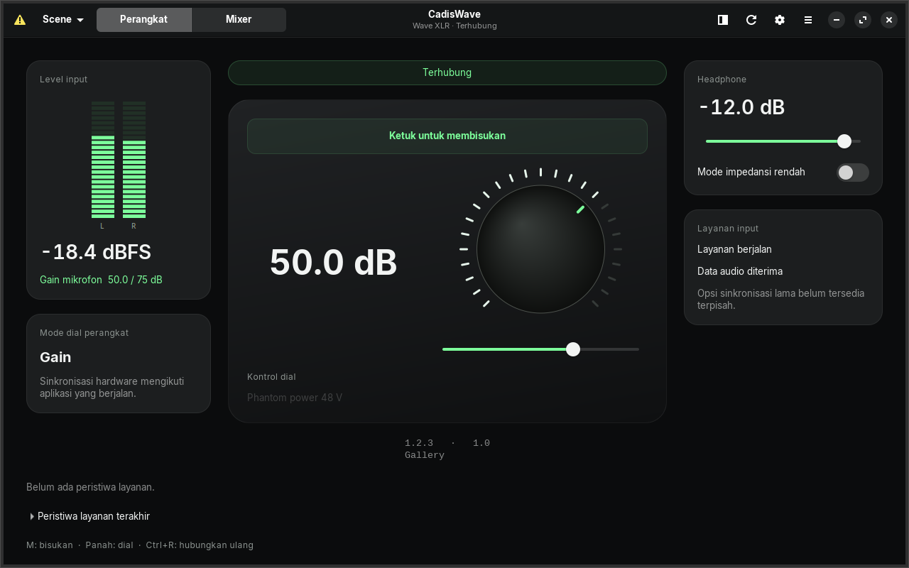
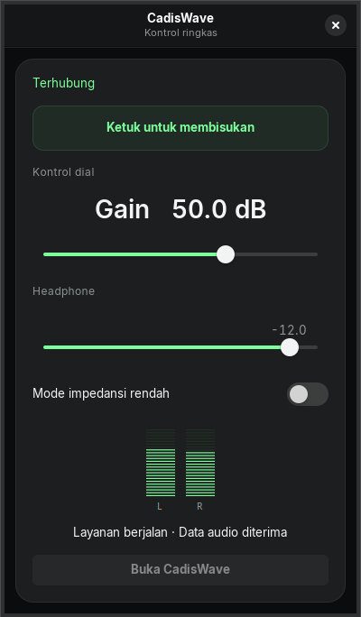
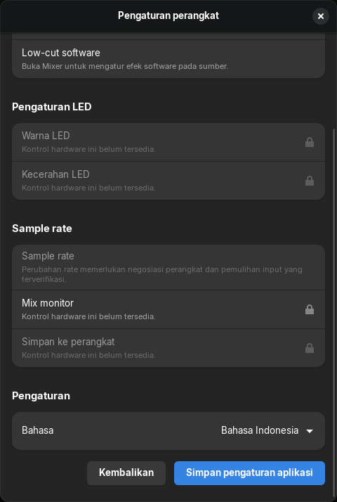

<p align="center">
  
</p>
<h1 align="center">CadisWave</h1>
<p align="center"><strong>Kontrol Wave kamu di Linux.</strong></p>
<p align="center">Atur mikrofon, routing audio, dan Wave XLR sehari-hari lewat aplikasi desktop native.</p>
<p align="center">
  <a href="https://github.com/RamaAditya49/cadiswave/actions/workflows/tests.yml"></a>
  <a href="LICENSE"></a>
  
</p>
<p align="center"><strong>Rust · GTK4 · libadwaita · PipeWire</strong></p>
<p align="center">
  <a href="README.md">English</a> ·
  <a href="#build-dan-jalankan">Build dan jalankan</a> ·
  <a href="CONTRIBUTING.md">Kontribusi</a> ·
  <a href="docs/verification.md">Hasil pengujian</a>
</p>



<p align="center"><sub>UI GTK asli dengan data uji terkontrol. Nilai meter berasal dari fixture pengujian.</sub></p>

## Untuk kontrol audio sehari-hari

| Fitur | Yang bisa kamu lakukan |
| --- | --- |
| Dashboard perangkat | Baca level input, atur gain, aktifkan mute, dan kontrol headphone. |
| Kontrol ringkas | Akses kontrol utama dalam jendela kecil. Gunakan tray jika desktop menyediakan tray host. |
| Mixer PipeWire | Kelola sumber aplikasi, mix terpisah, output, scene, dan efek software. |
| Inggris dan Indonesia | Ganti bahasa tanpa memulai ulang audio atau worker USB. |
| Status perangkat terkonfirmasi | Lihat nilai hasil pembacaan hardware, terpisah dari perubahan yang masih diproses. |
| Pemantauan capture | Periksa aktivitas byte capture dan koneksi. Pemulihan yang mengganggu audio harus diaktifkan secara eksplisit. |

## Lihat lebih dekat

<table>
  <tr>
    <th>Kontrol ringkas</th>
    <th>Pengaturan aplikasi</th>
  </tr>
  <tr>
    <td align="center"></td>
    <td align="center"></td>
  </tr>
</table>

Screenshot menampilkan aplikasi yang dirender dengan fixture GTK terkontrol, bukan mockup desain.
Lihat [asal screenshot](docs/images/README.md) untuk detail capture.

## Dukungan perangkat

| Perangkat | USB ID | Kontrol yang dipetakan | Pengujian fisik CadisWave |
| --- | --- | --- | --- |
| Wave XLR | `0fd9:007d` | Gain maksimal 75 dB, mute, phantom power, headphone, low impedance | Sudah diuji; lihat [hasil](docs/verification.md) |
| XLR Dock | `0fd9:00a6` | Gain, mute, phantom power, headphone, low impedance | Belum diuji di sini |
| Wave:3 | `0fd9:0070` | Gain, mute, headphone, monitor mix | Belum diuji di sini |
| XLR Dock MK.2 | `0fd9:00c7` | Gain, mute, phantom power, headphone, monitor mix, low impedance | Belum diuji di sini |

Kontrol yang dipetakan memiliki tes protokol. Hasilnya bukan bukti pengujian fisik untuk semua model atau firmware.
Baca [dukungan hardware](docs/hardware-support.md) sebelum memakai perangkat lain.

Clipguard, hardware low-cut, perubahan LED, penyimpanan ke perangkat, dan perubahan sample rate belum tersedia.
Mix monitor hardware Wave XLR asli belum dipetakan.
Gunakan Mixer untuk software low-cut, gate, compressor, EQ, delay, dan mono.
Mode dial yang tidak dikenal tidak dapat digunakan untuk mengubah nilai.

## Build dan jalankan

Gunakan **Rust 1.98.1**, GTK **4.14+**, libadwaita **1.5+**, libusb 1.0, dan pkg-config.
Audio menggunakan PipeWire, pipewire-pulse, WirePlumber, ALSA utilities, dan plugin SWH LADSPA.

Untuk Ubuntu 24.04, pasang dependensi:

```bash
sudo apt install build-essential pkg-config libgtk-4-dev libadwaita-1-dev libusb-1.0-0-dev \
  pipewire pipewire-pulse wireplumber alsa-utils pulseaudio-utils swh-plugins
rustup toolchain install 1.98.1 --component rustfmt --component clippy
```

Build dan pasang sebagai pengguna biasa:

```bash
git clone https://github.com/RamaAditya49/cadiswave.git
cd cadiswave
cargo build --release --locked --workspace --bins
make install PREFIX="$HOME/.local"
"$HOME/.local/bin/cadiswave"
```

Buka **Pengaturan** untuk memilih bahasa. Buka **Mixer** untuk sumber audio, efek, scene, dan pemilihan perangkat.

| Shortcut | Tindakan |
| --- | --- |
| `M` | Aktifkan atau nonaktifkan mute |
| Tombol panah pada slider dial | Atur nilai yang dipilih |
| `Ctrl+R` | Hubungkan ulang |

Untuk pemasangan sistem, jalankan `install.sh` sebagai pengguna biasa.
Installer menyiapkan dan memeriksa payload sebelum meminta akses administrator.
Lihat [pengaturan hardware](docs/hardware-support.md), [pemasangan Bazzite](docs/install-bazzite.md), dan [pemecahan masalah](docs/troubleshooting.md).

Aktifkan **Ikuti mute hardware** pada editor sumber capture olahan agar mute mengikuti perangkat Wave yang dipilih.

## Pindah dari OpenWave

Pertahankan instalasi lama sampai build baru lulus pemeriksaan.
Hentikan `openwave.service` sebelum CadisWave mengambil kontrol vendor.
CadisWave menolak pemilik vendor kedua. Impor opsional mempertahankan pengaturan yang sudah ada.
Ikuti [panduan migrasi dan pemulihan](docs/migration.md).

Aplikasi desktop memiliki sinkronisasi USB, termasuk saat tersembunyi melalui tray.
Daemon capture mempertahankan stream input; daemon tersebut bukan pengganti worker USB aplikasi desktop.

## Kontribusi

Mulai dari [panduan kontributor](CONTRIBUTING.md).
Baca [arsitektur](docs/ARCHITECTURE.md), [referensi protokol](docs/protocol.md), dan [panduan lokalisasi](docs/localization.md).
Laporkan bug dan usulan fitur lewat [GitHub issues](https://github.com/RamaAditya49/cadiswave/issues).
Sertakan model perangkat, USB ID, dan langkah reproduksi.

## Pengembang dan lisensi

**Dikembangkan dan dikelola oleh [Rama Aditya](https://github.com/RamaAditya49) (CADIS).**

CadisWave adalah proyek independen yang dikembangkan dari [OpenWave](https://github.com/rikkichy/openwave) oleh rikkichy dan kontributor.
Implementasi CadisWave dan artwork aplikasi baru: Rama Aditya (CADIS) dan kontributor.
[Lisensi MIT](LICENSE) tetap memuat copyright asli.
CadisWave bukan produk resmi Elgato.

Arsip desain dan file mockup tetap berada di luar repository.
Screenshot di atas merupakan dokumentasi aplikasi.
