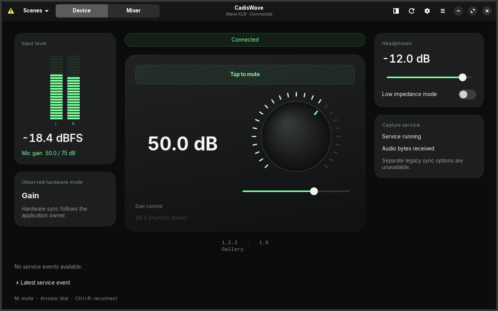
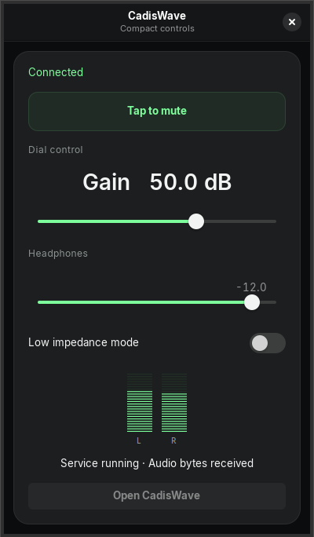
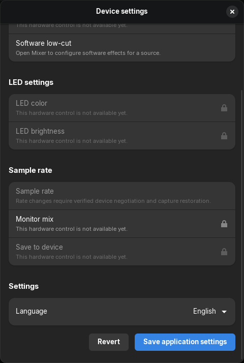

<p align="center">
  
</p>
<h1 align="center">CadisWave — Wave XLR software for Linux</h1>
<p align="center"><strong>Open-source Elgato Wave XLR controls and a PipeWire audio mixer.</strong></p>
<p align="center">Adjust microphone gain, mute, phantom power, and headphones from a native Linux desktop.</p>
<p align="center">
  <a href="https://github.com/RamaAditya49/cadiswave/actions/workflows/tests.yml"></a>
  <a href="LICENSE"></a>
  
</p>
<p align="center"><strong>Rust · GTK4 · libadwaita · PipeWire</strong></p>
<p align="center">
  <a href="README.id.md">Bahasa Indonesia</a> ·
  <a href="#build-and-run">Install from source</a> ·
  <a href="docs/wave-xlr-linux.md">Wave XLR Linux setup</a> ·
  <a href="#frequently-asked-questions">FAQ</a> ·
  <a href="CONTRIBUTING.md">Contribute</a> ·
  <a href="docs/verification.md">Test results</a>
</p>

**CadisWave is free, open-source Wave XLR software for Linux**, developed by [Rama Aditya](https://github.com/RamaAditya49) (CADIS).
It provides Elgato microphone controls, application audio routing, independent mixes, and software effects through PipeWire.
Use it as a native Linux alternative for Wave Link control and mixing workflows.
See the [feature limits](#device-support) before switching.

| Project facts | Details |
| --- | --- |
| Platform | Linux desktop with PipeWire; native Rust, GTK4, and libadwaita |
| Physically tested device | Original Elgato Wave XLR, USB `0fd9:007d` |
| Interface languages | English and Bahasa Indonesia |
| Install route | [Build from source](#build-and-run); see [Linux setup](docs/wave-xlr-linux.md) |
| License and maintainer | [MIT](LICENSE); Rama Aditya (CADIS) |
| Test evidence | [Software checks and physical results](docs/verification.md), recorded on 2026-10-04 |



<p align="center"><sub>Actual GTK interface, captured with controlled test data. Meter values show a test fixture.</sub></p>

## Made for your daily audio controls

| Feature | What you can do |
| --- | --- |
| Device dashboard | Read input levels, adjust gain, toggle mute, and control headphones. |
| Compact controls | Keep key controls nearby. Use the tray when your desktop provides a tray host. |
| Status icons | Green when live, red when muted, orange on error. Includes optional GNOME 46 dock integration. |
| Adaptive window | Restore a size that fits the current monitor. Use compact controls in a narrow layout. |
| PipeWire mixer | Manage application sources, independent mixes, outputs, scenes, and software effects. |
| English and Indonesian | Change the interface language without restarting audio or USB workers. |
| Confirmed device state | Read confirmed hardware values. Keep pending edits separate from actual device state. |
| Capture monitoring | Check capture byte activity and connection status. Enable disruptive recovery explicitly. |
| Microphone settings | Select a microphone, change low-cut, apply voice presets, and save named presets. |
| Microphone test | Record one to ten seconds in memory. Check peak levels and clipping. Play through a selected output. |

## A closer look

<table>
  <tr>
    <th>Compact controls</th>
    <th>Application settings</th>
  </tr>
  <tr>
    <td align="center"></td>
    <td align="center"></td>
  </tr>
</table>

These screenshots show the application with controlled GTK fixtures. They are not design mockups.
See [screenshot provenance](docs/images/README.md) for capture details.

## Device support

| Device | USB ID | Mapped controls | CadisWave physical checks |
| --- | --- | --- | --- |
| Wave XLR | `0fd9:007d` | Gain up to 75 dB, mute, phantom power, headphones, low impedance, monitor mix | Tested earlier controls; new monitor mapping has no local physical check; see [results](docs/verification.md) |
| XLR Dock | `0fd9:00a6` | Gain, mute, phantom power, headphones, low impedance | Not tested here |
| Wave:3 | `0fd9:0070` | Gain, mute, headphones, monitor mix, Clipguard (API 5.3/5.4) | Not tested here |
| XLR Dock MK.2 | `0fd9:00c7` | Gain, mute, phantom power, headphones, monitor mix, low impedance, Clipguard, hardware low-cut | Not tested here |

Mapped controls have protocol tests. This does not establish physical acceptance for every model or firmware.
Read [hardware support](docs/hardware-support.md) before using another device.

Device settings show controls for each exact device profile. Unsupported controls include an explanation.
LED changes, explicit device persistence, and sample-rate changes remain unavailable.
Sample-rate readings distinguish an observed stream format from a configured property.
Use device settings for software low-cut and voice presets. Use Mixer for gate, compression, EQ, delay, and mono effects.
Unknown hardware dial modes disable dial edits.

## Build and run

Use **Rust 1.98.1**, GTK **4.14+**, libadwaita **1.5+**, libusb 1.0, and pkg-config.
Runtime audio uses PipeWire, pipewire-pulse, WirePlumber, ALSA utilities, and SWH LADSPA plugins.

On Ubuntu 24.04, install the dependencies:

```bash
sudo apt install build-essential pkg-config libgtk-4-dev libadwaita-1-dev libusb-1.0-0-dev \
  pipewire pipewire-pulse wireplumber alsa-utils pulseaudio-utils swh-plugins
rustup toolchain install 1.98.1 --component rustfmt --component clippy
```

Build and install as your login user:

```bash
git clone https://github.com/RamaAditya49/cadiswave.git
cd cadiswave
cargo build --release --locked --workspace --bins
make install PREFIX="$HOME/.local"
"$HOME/.local/bin/cadiswave"
```

Open **Settings** to select a language. Open **Mixer** for sources, effects, scenes, and device selection.

| Shortcut | Action |
| --- | --- |
| `M` | Toggle mute |
| Arrow keys on the dial slider | Adjust the selected value |
| `Ctrl+R` | Reconnect |

Run `install.sh` as your login user for a system installation.
The installer stages and checks files before requesting administrator access.
See [hardware setup](docs/hardware-support.md), [Bazzite installation](docs/install-bazzite.md), and [troubleshooting](docs/troubleshooting.md).

Enable **Follow hardware mute** in a processed capture source editor to synchronize mute with the selected Wave device.

## Move from OpenWave

Keep the old installation until the new build passes its checks.
Stop the legacy `openwave.service` before granting CadisWave vendor control.
CadisWave rejects a second vendor owner. Optional import preserves existing settings.
Follow the [migration and recovery guide](docs/migration.md).

The desktop runtime owns USB synchronization, including hidden tray operation.
The capture daemon maintains input streams. It does not replace the desktop USB owner.

## Frequently asked questions

### What software controls Elgato Wave XLR on Linux?

CadisWave controls the original Wave XLR on Linux through USB and ALSA synchronization.
It provides gain, mute, 48 V phantom power, headphone volume, and low-impedance controls.
See [physical test results](docs/verification.md#physical-acceptance) and the [setup guide](docs/wave-xlr-linux.md).

### Does Elgato Wave Link support Linux?

Elgato's [Wave Link 3 setup guide](https://help.elgato.com/hc/en-us/articles/46941178829585-Wave-Link-3-0-Software-Initial-Setup) lists Windows, Mac, and Windows on Arm.
It does not list Linux.
CadisWave is an independent Linux application for device controls and PipeWire mixing.
It does not provide every Wave Link feature.

### Can I mix game, chat, browser, and microphone audio?

Yes. Use the PipeWire mixer to manage application sources, capture sources, sends, independent mixes, and outputs.
Select a published mix as the input in OBS or a voice application.
Read the [routing walkthrough](docs/wave-xlr-linux.md#mix-application-and-microphone-audio) before changing your active audio routes.

### Which Linux distributions have been tested?

Physical checks used Zorin OS 18.1 with GTK 4.14.5, libadwaita 1.5.0, and PipeWire 1.0.5.
CI runs on Ubuntu 24.04.
The [Bazzite and Fedora Atomic guide](docs/install-bazzite.md) describes another installation route; those images have no recorded physical acceptance here.
See [verification](docs/verification.md) for build dependencies and test limits.

### Is CadisWave a complete Wave Link replacement?

CadisWave provides device controls, routing, scenes, and host-side effects.
Clipguard and hardware low-cut depend on the exact device profile.
LED changes, explicit device persistence, and sample-rate changes remain unavailable.
See [device support](#device-support) for each model's scope.

### Where can I download or install CadisWave?

Use the [source installation steps](#build-and-run) for the current native application.
Existing `v0.1.x` releases belong to the earlier OpenWave application.
They are not current native CadisWave builds.

### Can I use CadisWave in Indonesian?

Yes. Select English or Bahasa Indonesia in Settings.
Language changes do not restart the audio or USB workers.
Read the [Indonesian README](README.id.md) for installation and support details.

## Contribute

Start with the [contributor guide](CONTRIBUTING.md).
Read the [architecture](docs/ARCHITECTURE.md), [protocol reference](docs/protocol.md), and [localization guide](docs/localization.md).
Use [GitHub issues](https://github.com/RamaAditya49/cadiswave/issues) for bugs and feature requests.
Include your device model, USB ID, and reproduction steps.

## People and license

**Developed and maintained by [Rama Aditya](https://github.com/RamaAditya49) (CADIS).**

CadisWave is an independent project derived from [OpenWave](https://github.com/rikkichy/openwave) by rikkichy and contributors.
CadisWave implementation and original application artwork: Rama Aditya (CADIS) and contributors.
The [MIT license](LICENSE) retains the original copyright.
CadisWave is not an Elgato product.

Design archives and mockup files remain outside this repository.
The screenshots above are application documentation.
